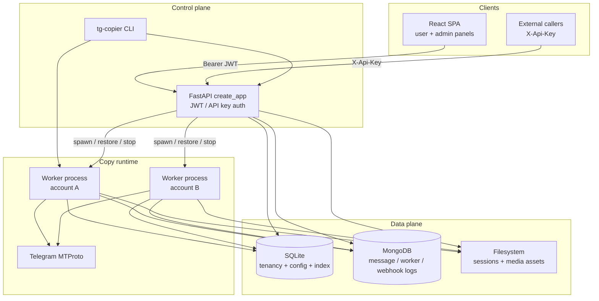
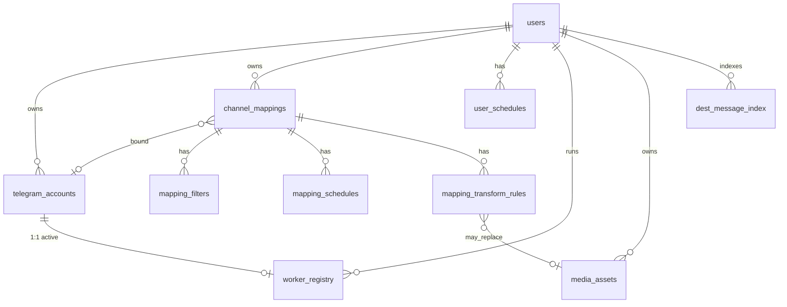
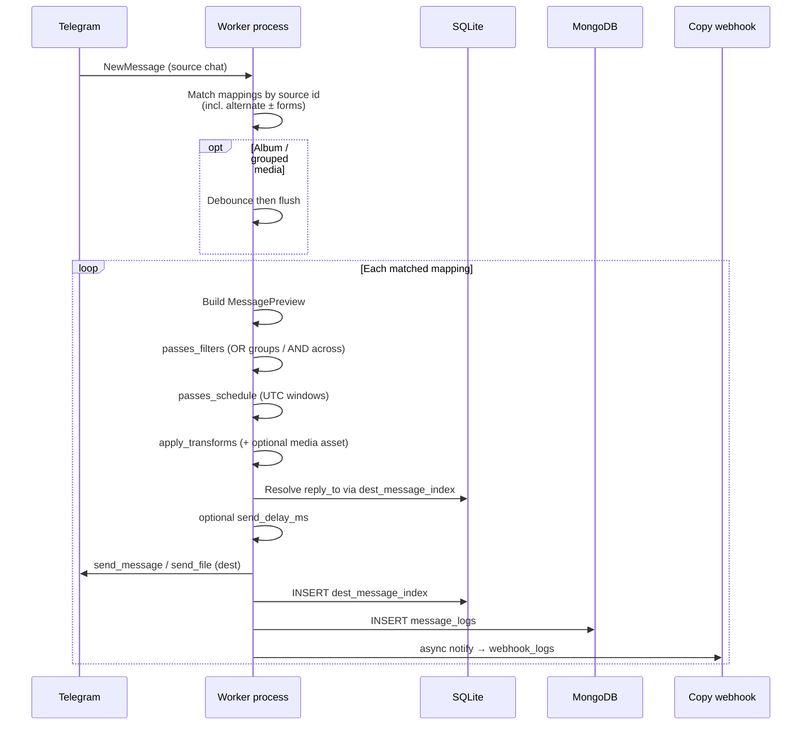
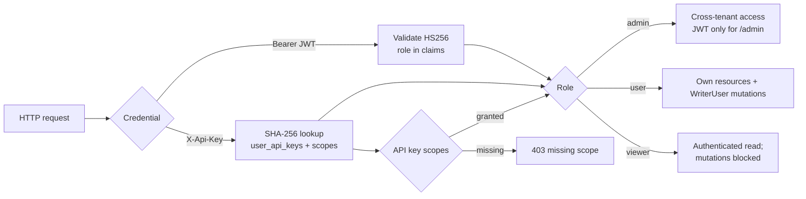
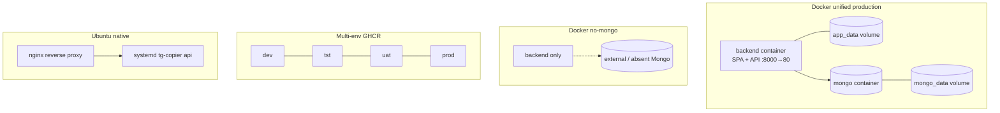

# Architecture

**Single source of truth** for system design of Telegram Client Copier. Ops runbooks, feature→file maps, and product README defer to this document for component boundaries, data flow, and invariants. When behavior changes, update this file in the same change set.

Related docs: [Developer cheat sheet](dev-cheatsheet.md) (implementation map), [docs index](README.md) (deploy/ops), root [README](../README.md) (quick start / product surface).

---

## 1. High-level system overview

Telegram Client Copier is a **multi-tenant control plane** that copies Telegram messages from source chats to destination chats according to per-mapping rules. Tenants authenticate to a FastAPI API and React SPA. Copying itself runs in **out-of-process Telethon workers**—one OS process per Telegram account—so session I/O and MTProto event loops stay isolated from the API process.

Durable configuration (users, accounts, mappings, filters, schedules, transforms, worker registry, reply index) lives in **SQLite**. Operational telemetry (message copy audit, worker logs, webhook delivery logs) lives in **MongoDB** and is allowed to soft-fail without stopping the copy path.



### Architectural invariants

1. **Tenant boundary** is `users.id`. Domain rows are user-scoped; only `admin` crosses tenants.
2. **Workers are subprocesses**, not in-API Telethon clients. The API owns lifecycle (spawn, heartbeat registry, restore-on-boot, terminate-on-shutdown).
3. **One worker ↔ one Telegram account** (`worker_registry` uniqueness on account).
4. **SQLite is system of record** for config and reply mapping; Mongo is observability.
5. **Copy pipeline order** is filter → schedule → transform → send → index → logs / webhooks.
6. **Pure decision logic** for filter/schedule/transform lives in previewable modules so API “dry run” and workers share the same rules.

---

## 2. Component responsibilities

### 2.1 Control plane (`src/app/web`)

`create_app` mounts all `/api` routers, optional SPA static serving (`FRONTEND_DIST_DIR`), CORS, and a lifespan that initializes SQLite, ensures Mongo indexes (unless `TESTING`), restores workers after a short delay, and runs a stale-worker alert loop.

| Area | Module(s) | Responsibility |
|------|-----------|----------------|
| Auth | `auth/`, `web/deps.py`, `web/scope_deps.py`, `routers/auth.py`, `routers/api_keys.py`, `routers/admin_invites.py` | JWT access/refresh, password hashing, `X-Api-Key` + scopes, admin invites (create/list/revoke + public accept), role guards (`admin` / writer / viewer) |
| Tenancy admin | `routers/admin_users.py`, `admin_invites.py`, `admin_settings.py`, `admin_stats.py` | User CRUD, invites, global settings (including Mongo URI override in `app_settings`), cross-tenant analytics |
| Accounts | `routers/accounts.py`, `accounts_login.py` | Telegram account records; phone-code login wizard writing session files |
| Mappings & rules | `routers/mappings.py`, `filters.py`, `schedules.py`, `transforms.py`, `media_assets.py` | CRUD for copy configuration; filter/transform changes may restart affected workers |
| Workers | `routers/workers.py` | Start/stop/list/restore; process spawn via CLI entry |
| Observability APIs | `message_logs.py`, `worker_logs.py`, `webhook_logs.py`, `message_index.py`, `stats.py` | Query Mongo logs and SQLite reply index |
| Alerts / flags | `alert_webhooks.py`, `user_feature_flags.py` | Stale-worker notifications; per-user feature flags in `app_settings` |
| Access control | `mapping_access.py` | Own-vs-admin scope for mapping-bound resources |

### 2.2 Copy runtime (`src/app/worker.py`, `telegram/`)

| Module | Responsibility |
|--------|----------------|
| `worker.py` | Process entry: copy session file to avoid SQLite locks, load enabled mappings, start Telethon, heartbeat `worker_registry`, attach handlers |
| `telegram/client_manager.py` | Construct/start user client; register event handlers |
| `telegram/handlers.py` | New / edit / delete / album debounce; send to destination; write index + logs; fire copy webhooks |
| `telegram/pipeline_preview.py` | Pure filter / schedule / transform evaluation shared with preview APIs |
| `telegram/dialog_service.py` | List dialogs for UI chat pickers |
| `telegram/chat_ids.py` | Normalize ± chat id forms for matching |

### 2.3 Domain services (`src/app/services`)

| Service | Responsibility |
|---------|----------------|
| `mapping_service.py` | Aggregate `ChannelMapping` (filters, schedules, transforms) for workers |
| `http_notify.py` | Outbound copy / alert webhooks |
| `alert_checker.py` | Periodic stale-worker detection from API lifespan |
| `app_settings.py` | Key/value settings; resolve effective Mongo URI |
| `feature_flags.py` | Per-user flag get/set |

### 2.4 Persistence (`src/app/db`)

| Store | Module(s) | Owns |
|-------|-----------|------|
| SQLite | `sqlite.py`, `migrations.py` | Schema bootstrap + incremental `_migrations`; users, accounts, mappings, filters, schedules, transforms, media metadata, worker registry, dest message index, refresh tokens, API keys, admin invites (hashed token + role + used_at), app settings |
| Mongo | `mongo.py`, `mongo_indexes.py` | `message_logs`, `worker_logs`, `webhook_logs` with query indexes plus **30-day TTL** on `timestamp` (`ix_ttl_30d`) |
| Cleanup | `cleanup.py`, `message_index_cleanup.py` | Login-session retention; orphan dest-index purge |

Note: an `alembic/` tree may exist on disk; **live SQLite evolution is `db/migrations.py`**, not Alembic.

### 2.5 Frontend (`frontend/`)

Vite + React SPA with two surfaces:

- **User panel** (`/`): dashboard, accounts, mappings (+ detail for filters/transforms/schedules, clone), workers, logs, message index, schedule, media assets, API keys, alert webhooks.
- **Admin panel** (`/admin`): users, all mappings (clone), workers, logs, settings, cross-tenant views (API keys and alert webhooks link to user routes).

Auth state (`AuthContext`) sends Bearer tokens to `/api`. Dev mode proxies to the API; production unified image serves the built SPA from the same FastAPI process.

### 2.6 CLI (`tg-copier`)

Entrypoint `app.main:run` (Typer):

| Command | Role |
|---------|------|
| `tg-copier api` | Uvicorn + `create_app` |
| `tg-copier db init-db` | Schema + migrations |
| `tg-copier db create-admin` | Bootstrap first admin |
| `tg-copier db run-worker` | Worker process (also spawned by API) |
| `tg-copier db show-config` / `test-mongo` / `show-mappings` / `purge-message-index` | Ops / debug |

---

## 3. Domain model



| Concept | Meaning |
|---------|---------|
| **User** | Tenant principal with role `admin` \| `user` \| `viewer` |
| **Telegram account** | Telethon session bound to a user; worker unit of scale |
| **Mapping** | Source chat → destination chat, optional account binding, delays, edit/delete sync, copy-webhook URL |
| **Filter** | Message admission rules; same `or_group_id` → OR within group; distinct groups → AND across groups |
| **Schedule** | Weekday UTC windows; mapping schedule falls back to user schedule |
| **Transform** | Priority-ordered text/regex/emoji/template/media replacements before send |
| **Dest message index** | `(user, src_chat, src_msg, dest_chat) → dest_msg` for replies and edit/delete sync |
| **Worker registry** | PID / heartbeat / account binding for process supervision |

---

## 4. Data flow — message copy



**Edits and deletes** follow the same mapping match when `sync_edits` / `sync_deletes` are enabled: re-evaluate filter/schedule/transform as needed, then edit or delete destination messages using the index.

**Preview path:** API mapping preview endpoints call the same pure pipeline functions without Telethon send, keeping UI “would this copy?” aligned with workers.

---

## 5. AuthN / AuthZ and multi-tenancy



Refresh tokens are stored hashed in SQLite. Feature flags are per-user JSON blobs in `app_settings` (`user_feature_flags_{id}`), not a separate tenancy database.

### Admin invites

Admins create invites (`POST /api/admin/invites`) with email + role; the plaintext token is shown once and stored as SHA-256 (`token_hash`). Invitees open `/invite/{token}`, set a password via public `GET/POST /api/auth/invites/{token}`, and receive a JWT pair. Used or expired invites return 410. Direct “create user with password” remains available for operators who set credentials themselves.

### API key scopes

JWT sessions ignore scopes and use role checks only. When `auth_via` is `api_key`, every routed family also requires at least one matching scope from the catalog in `app/auth/scopes.py` (enforced via `app/web/scope_deps.py` router dependencies).

| Scope | Allows |
|-------|--------|
| `mappings:read` / `mappings:write` | Mappings, filters, transforms, schedules, media assets; `POST …/preview` counts as read |
| `accounts:read` / `accounts:write` | Accounts + phone login wizard |
| `workers:read` / `workers:write` | List / start / stop workers |
| `logs:read` | Message, worker, webhook logs; message index |
| `stats:read` | User dashboard stats |
| `keys:read` / `keys:write` | List / create / revoke own API keys |
| `webhooks:read` / `webhooks:write` | Alert webhook CRUD |

Unknown scopes are rejected on create (422). Default create string is `mappings:read,mappings:write`. **Admin routes** (`AdminUser`) and feature-flag / profile-mutation endpoints reject API keys entirely (JWT required). The user panel manages keys at `/api-keys`.

---

## 6. Deployment topologies



| Topology | Doc | Shape |
|----------|-----|--------|
| Unified prod | [docker-production.md](docker-production.md) | SPA+API image + Mongo; named volumes |
| No Mongo container | [docker-production-no-mongo.md](docker-production-no-mongo.md) | App only; optional external Mongo |
| Multi-env | [docker-multi-env.md](docker-multi-env.md) | Isolated compose projects, env files, ports, volumes; GHCR images |
| Dev overlay | [docker-development.md](docker-development.md) | Vite `:5173` + API reload |
| Native VPS | [deploy-ubuntu.md](deploy-ubuntu.md) | venv + systemd + nginx; `update-vps.sh` auto-backs up `data/` + `.env` under `backups/` before pull |
| CI/CD | [github-actions-ci-cd.md](github-actions-ci-cd.md) | Tests → publish → optional SSH deploy |

Durable paths in containers typically map under `/app/data` (`SQLITE_PATH`, `SESSIONS_DIR`, `MEDIA_ASSETS_DIR`).

---

## 7. Integration points

| Integration | Direction | Notes |
|-------------|-----------|-------|
| Telegram MTProto (Telethon) | Outbound / event-driven | Requires `API_ID` / `API_HASH`; sessions on disk |
| MongoDB | Bidirectional | Logs + indexes; URI overridable via admin `app_settings` |
| Copy webhooks | Outbound HTTP | Per-mapping notify after successful copy; results in `webhook_logs` |
| Alert webhooks | Outbound HTTP | Stale worker alerts from API background loop; panel CRUD at `/alert-webhooks` |
| SPA ↔ API | Browser | JWT; Vite proxy in dev; same-origin in unified image |
| External API clients | Inbound | `X-Api-Key` header; scopes from `user_api_keys` enforced per route family |

---

## 8. Failure modes

| Failure | Expected behavior | Mitigation |
|---------|-------------------|------------|
| Mongo unreachable | Copy path continues; worker/message/webhook logging degrades with warnings | Soft-fail handlers; `tg-copier db test-mongo`; ops docs |
| Session file locked / contended | Worker copies session to `*_worker_{pid}.session` before connect | Copy-on-start in `worker.py`; see [WORKER_TROUBLESHOOTING.md](WORKER_TROUBLESHOOTING.md) |
| Worker process crash | Heartbeat stops; registry stale | API restore-on-boot; alert checker (~90s loop); manual start/stop in UI |
| API restart | In-memory spawn map lost | Delayed `restore_workers_from_db` on lifespan |
| Chat id invalid / migrated | Send may retry alternate ± id forms | `chat_ids` helpers + handler fallbacks |
| Filter/schedule reject | Message skipped (no send) | Preview API for debugging |
| Transform / media asset missing | Rule may no-op or skip media replacement | Validate assets in UI; check worker logs |
| SQLite migration failure | App should not run on inconsistent schema | `init-db` + `tests/unit/test_migrations.py` |
| Auth secret default | Insecure tokens if `JWT_SECRET` left as default | Require strong secret in production env examples |

---

## 9. Scalability considerations

**Current scale model** is vertical / process-per-account on a single host:

- Throughput scales with number of worker processes and Telegram rate limits, not with API replicas alone.
- SQLite is a single-writer store for config and reply index; high concurrent write pressure on `dest_message_index` is the primary DB bottleneck to watch.
- Mongo absorbs high-volume append logs and can be sized / TTL’d independently of SQLite. All three log collections (`message_logs`, `worker_logs`, `webhook_logs`) use a **30-day** TTL index on `timestamp` (`ix_ttl_30d`); API boot recreates legacy non-TTL timestamp indexes when needed.
- API horizontal scale is limited by: (a) worker spawn affinity to the host that holds session files, (b) SQLite file locking, (c) in-process worker bookkeeping. Multi-host active-active API is **not** an assumed topology today.

**Intentional growth paths** (not yet productized; record here so changes stay intentional):

1. Keep workers pinned to session storage locality (sticky host or shared network volume with clear lock strategy).
2. If reply-index write volume dominates, consider sharding index by `user_id` or moving hot index paths to a write-friendly store—only with migration notes and dual-read plan.
3. Treat Mongo as the unbounded log stream; **30-day TTL is productized** on message/worker/webhook logs. Prefer adjusting `LOG_TTL_SECONDS` / index catalog intentionally (with migration notes) over ad-hoc retention scripts.
4. Preserve the pure pipeline module boundary so rule evaluation can move to sidecars without rewriting Telethon I/O.

---

## 10. Configuration boundaries

| Env / setting | Boundary |
|---------------|----------|
| `API_ID`, `API_HASH` | Required for Telethon |
| `JWT_SECRET`, algorithm, TTLs | Auth |
| `SQLITE_PATH`, `SESSIONS_DIR`, `MEDIA_ASSETS_DIR` | Local durable state |
| `MONGO_URI`, `MONGO_DB` | Log store; runtime override via SQLite `app_settings` |
| `FRONTEND_DIST_DIR` | Empty → API-only; set in Docker unified image |
| `TESTING` | Skip Mongo index ensure / delayed worker restore |
| `BOT_TOKEN`, `TELEGRAM_TEST_CHAT_ID` | Live integration tests only |

Secrets must not be committed (`docker.env`, `deploy/env/docker.env.*`, `.env`). Examples stay in sync with docs when variables change.

---

## 11. Test architecture expectations

Tests encode the architectural contracts above:

| Layer | Location | Guards |
|-------|----------|--------|
| Unit | `tests/unit` | Filters, schedules, migrations, SPA static helpers |
| API | `tests/api` | Auth, CRUD routers, worker control surface |
| Functional | `tests/functional` | Handler flow (filter → schedule → transform → send semantics) |
| Integration | `tests/integration` | Mapping service, reply index, worker restore, Mongo (optional live Telethon) |
| Frontend | `frontend` Vitest | Panel behavior, schedule/timezone, mapping detail |

CI-equivalent backend gate skips live Telegram:  
`pytest -q --ignore=tests/integration/test_telethon_live.py`.

Feature-level command map: [dev-cheatsheet.md](dev-cheatsheet.md).

---

## 12. Documentation ownership

| Change type | Update this architecture doc? | Also update |
|-------------|-------------------------------|-------------|
| New runtime component / process boundary | **Yes** — components + diagrams | cheatsheet, relevant ops guide |
| Pipeline order or filter/schedule/transform semantics | **Yes** — data flow + invariants | README product sections, unit/functional tests |
| Auth / tenancy / roles | **Yes** | API tests, cheatsheet |
| Deploy topology only | Section 6 if topology class changes | matching `docs/docker-*.md` / Ubuntu / CI |
| UI-only copy or styling | No | frontend as needed |
| Env var added/removed | Section 10 | `*.example` env files + deploy docs |
| Non-trivial feature / AuthZ / schema plan | No (unless design lands) | `docs/plans/YYYY-MM-DD-*.md` before implementation |

### Change protocol

1. Re-read this document and note impacted sections.
2. Write a short planning note under `docs/plans/` (see [plans/README.md](plans/README.md)); cover impacts, risks, doc/test updates.
3. Add or extend failing tests that express the architectural expectation.
4. Implement the minimal change that restores green tests.
5. Sync this file, cheatsheet, and any operator-facing guide in the same change.

---

## 13. Package map (quick reference)

```
src/app/
  main.py              # Typer: api + db
  config.py            # Settings from env
  worker.py            # Worker process
  auth/                # JWT + passwords + API key scopes
  cli/                 # db subcommands
  db/                  # SQLite + Mongo + cleanup
  services/            # Mapping aggregate, webhooks, alerts, settings
  telegram/            # Telethon client, handlers, pipeline
  web/                 # FastAPI app, deps, scope_deps, routers, schemas
frontend/              # React SPA
tests/                 # unit / api / functional / integration
deploy/                # Multi-env compose + env examples
docs/                  # Architecture (this file) + ops guides
```
