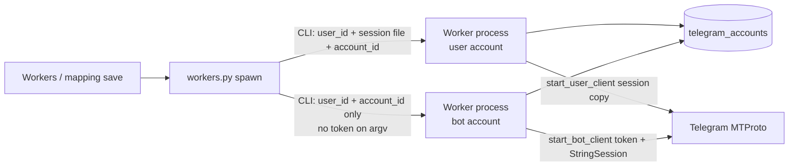

# Plan: Bot workers alongside user-session workers

**Date:** 2026-09-18  
**Status:** Done  
**Architecture SoT:** `docs/architecture.md` §1 invariants 2–3, §2.2 copy runtime, §2.1 workers router

## What / why

Today a **user (phone / `.session`) account** can run a copy worker. A **bot account** can be stored and bound to a mapping, but workers refuse it (`Account has no session path`). Bot-only tenants therefore cannot copy anything.

Goal: **the same copy product for both account types**, with one worker process per Telegram account. Phone workers stay as they are. Bot workers start from a BotFather token, reuse the existing filter → schedule → transform → send pipeline, and appear on the Workers page.

This does **not** make bots behave like user accounts on Telegram. Bots only see chats they belong to, cannot list dialogs, and send as the bot identity.

---

## What a bot worker can and cannot do

| Capability | User worker | Bot worker |
|------------|-------------|------------|
| Start/stop/restore from panel | Yes | Yes (this plan) |
| Copy **new** messages it can see | Yes | Yes, if membership + privacy rules allow |
| List chats for pickers | Yes (`iter_dialogs`) | **No** — keep manual chat IDs |
| Join chats by itself | User can join (if invited) | **No** — admin must add the bot |
| Read a private channel it is not in | If the user is a member | **No** |
| See all group messages | Yes | Only if **Group Privacy is disabled** in BotFather (`/setprivacy` → Disable) **and** the bot is in the group |
| Read channel posts | If user is member | Bot must be **admin** on the source channel |
| Post to destination | As the user | As the **bot** (bot must be allowed to post) |
| Edit/delete dest messages it sent | Yes | Yes (own messages). Sync of *other people’s* dest messages often fails |
| History backfill | Out of scope (both) | Out of scope |

**Operator setup (bot copy path):**

1. Create bot in BotFather; copy `123456:AAH…` token into Accounts.
2. Add the bot to **source** (channel: admin; group: member + privacy off).
3. Add the bot to **destination** with permission to post (and edit/delete if those mapping flags are on).
4. Create mapping with **manual** source/dest chat IDs (e.g. `-100…`).
5. Start the worker for that bot account (or let mapping save auto-spawn).

If any of 2–3 is missing, the worker can be “running” but copy nothing useful — logs should say why when Telegram errors (chat not found, not participant, `ChatAdminRequired`).

---

## Architectural impact (vs `docs/architecture.md`)

**Keep invariants:**

- Workers remain **OS subprocesses**, not in-API Telethon.
- **One worker ↔ one `telegram_accounts` row** (user *or* bot).
- Pipeline order unchanged; handlers stay shared.

**Change:**

- Account is the worker unit whether credentials are a **session file** or a **bot token**.
- Spawn **by `account_id`**. The child process loads type + credentials from SQLite. **Never put `bot_token` on the CLI** (visible in `ps`, Docker inspect, stderr paths).
- `worker_registry.session_path` is currently `NOT NULL`. Avoid a schema change in MVP: store a sentinel for bots, e.g. `bot://{account_id}`. Restore/start read account type from `telegram_accounts`, not from that string as a filesystem path.
- `start_bot_client` already uses in-memory `StringSession` (no shared `bot_session` file). Worker uses that path.
- `restart_workers_for_mapping` / restore currently skip rows with empty `session_path` — they must start bot accounts that have a valid token.
- Domain wording in architecture §3 (“Telethon session bound to a user”) becomes “Telethon **user session or bot token** bound to a tenant account.”

Phone workers: unchanged copy-on-start of `.session` to `*_worker_{pid}.session`.

---

## Practical design (MVP)

### 1. Worker process (`worker.py` + CLI)

- `tg-copier db run-worker <user_id> --account-id N` with **optional** `session_path`.
- If `session_path` omitted/sentinel: load account; `type=bot` → `start_bot_client(bot_token)`; `type=user` → require session path (today’s behavior).
- Log `account_type=bot|user` at start.
- Same `build_message_handlers` / FloodWait / skip reasons / index / webhooks.

### 2. Spawn / restore (`workers.py`)

- `POST /workers/start`: allow `type=bot` when `bot_token` is present and valid shape; drop the 400 “bot accounts cannot run workers”.
- `_spawn_worker_for_account`: branch argv; registry `session_path` = real path or `bot://{id}`.
- `restart_workers_for_mapping`: include active bots with tokens (not only `session_path != ''`).
- `restore_workers_from_db`: if registry path is `bot://…` or account is bot, spawn bot worker; do not `Path().resolve()` a fake file.

### 3. Panel

- **Workers** (user + admin): list **active bots** as startable, labeled `(bot)`.
- **MappingRouteFields**: keep manual IDs for bots; replace “cannot start workers” with membership/privacy instructions + “Start a worker on Workers after saving.”
- Dashboard setup `worker` already keys off live registry — bot workers should tick it once running.

### 4. Mapping validation / errors

- Keep allowing bot-bound mappings.
- On send failures typical for bots, log `status=failed` with Telegram error text (already in handler path). Optional later: classify `not_participant` / `admin_required` skip reasons.

### 5. Explicitly out of MVP

- Dialog listing for bots.
- Auto-join, invite links, or “pick chats the bot is in” via Bot API `getUpdates` chat cache.
- Encrypting `bot_token` at rest (today tokens are plaintext, same as session files on disk).
- HTTP Bot API rewrite (would duplicate handlers; MTProto Telethon bot client is the right reuse).
- History catch-up / `iter_messages` backfill.

---

## Risks + mitigations

| Risk | Mitigation |
|------|------------|
| User expects bot to see all groups | Docs + mapping hint: BotFather privacy **Disable**; bot must be in both chats |
| Worker “green” but zero copies | Start log lists `source_chat_ids`; first Telegram access error goes to message/worker logs |
| Token leaked on process list | Spawn without token argv; child reads SQLite |
| Sentinel `bot://` mistaken for a file | Spawn/restore only treat `bot://` as bot; never `copy2` |
| Two workers same bot token | Keep UNIQUE(`account_id`); one row per bot account |
| Edit/delete sync fails on dest | Document: bot can edit/delete **its own** dest messages; `append_notice` still works as new send |
| FloodWait / bot rate limits | Existing `call_with_flood_retry`; bots often stricter — operator uses delay / fewer mappings per bot |
| Invalid stored tokens (display names) | Create already validates BotFather shape; start-worker 400 if token invalid |
| Mapping auto-restart skipped bots | Fix `restart_workers_for_mapping` in same change |
| Session lock N/A for bots | Skip session copy for bots; no 409 “stop worker to list chats” for bots (already skip dialogs) |

---

## Doc updates required

| Doc | Change |
|-----|--------|
| `docs/architecture.md` | Account = user session **or** bot token; worker spawn by account; bot StringSession; workers UI |
| `docs/dev-cheatsheet.md` | Bot workers → `worker.py`, `workers.py`, CLI, Workers.tsx |
| `docs/WORKER_TROUBLESHOOTING.md` | Bot membership, privacy mode, `ChatAdminRequired`, no dialogs |
| Root `README.md` / product surface | Bot copy is supported with those constraints |
| Mapping UI copy | Practical setup steps, not “bots cannot run workers” |
| This plan + `docs/plans/README.md` | Index; status → Done after ship |

No Docker/env change expected (same `API_ID` / `API_HASH` for Telethon bot start).

---

## Test plan

**Backend (first, failing then green):**

- `start_worker` 200 for active bot with valid token; 400 if token missing/invalid; still 400 for user with no session.
- Spawn command for bot does **not** include the token string.
- `run_worker` with bot account mocks `start_bot_client`, does not copy a session file, attaches handlers, disconnects cleanly.
- `restart_workers_for_mapping` spawns bot account when mapping bound to bot.
- `restore_workers_from_db` respawns `bot://` registry rows.
- Existing user worker tests stay green (`test_workers_api.py`, `test_worker_restore.py`).
- Handler flow unchanged (reuse `test_handler_flow.py`); optional unit: bot client used as `event.client` still sends.

**Frontend:**

- Workers page shows bot account Start.
- MappingRouteFields bot hint no longer says workers are impossible; still forces manual IDs.

**Manual (local Docker after implement):**

1. Re-add bot with real BotFather token.
2. Add bot as admin to a test source channel + dest chat.
3. Mapping with manual IDs → save → worker starts.
4. Post in source → dest receives as the bot.
5. Confirm user-session worker still starts independently on another account.

---

## Implementation order

1. **Tests first** — API start/restore/restart + worker unit mocks (no live Telegram).
2. **CLI + `run_worker`** — load account by id; branch user vs bot client.
3. **`workers.py` spawn/start/restore/restart** — sentinel path; include bots.
4. **SPA** — Workers list; mapping hint; cheatsheet/architecture/troubleshooting.
5. **Green gates** — `pytest tests/api/test_workers_api.py tests/integration/test_worker_restore.py` + new tests; frontend Workers/MappingRouteFields tests; then broader pack.

Do not implement until this plan is approved.

---

## Suggested later phases (not this change)

| Phase | Work |
|-------|------|
| 2 | `get_entity` resolve of `@username` / numeric ID on mapping save (bot must already see the chat) |
| 3 | Preflight: “can this bot access source/dest?” with a clear 400 before save |
| 4 | Optional persist bot StringSession to `sessions/{user}/{id}.bot.session` for faster reconnect |
| 5 | Token-at-rest encryption if we encrypt session files |

---

## Recommendation

Ship **MVP bot workers** as described: same process model as phone workers, token never on argv, manual chat IDs, honest Telegram limits in the UI. That makes a bot-only tenant able to copy **in chats the bot is allowed to see and post to**. It will not replace a user account for “copy every channel I’m subscribed to.”
