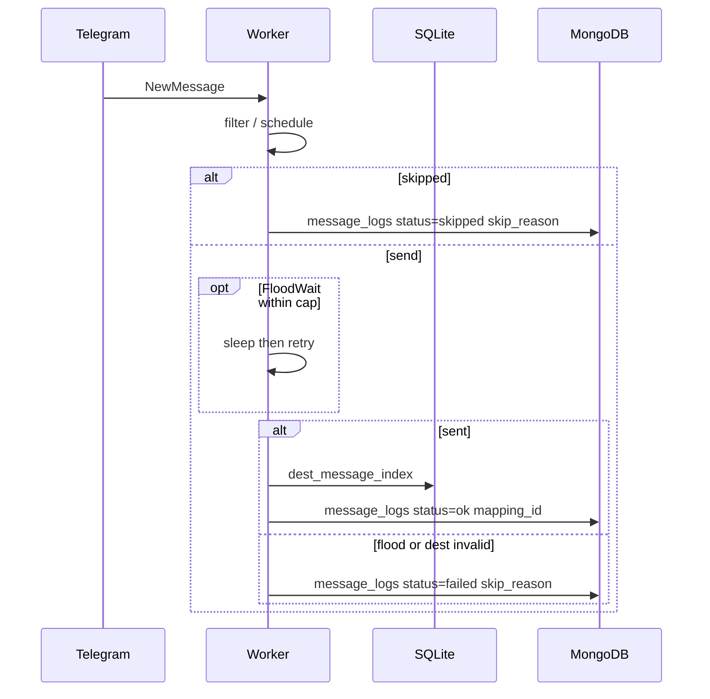

# Plan: Setup checklist, FloodWait retry, skip reasons

**Date:** 2026-09-18  
**Status:** Done  
**Architecture SoT:** `docs/architecture.md` §2.1 (stats / message logs), §4 (copy pipeline), §8 (FloodWait / filter skip), §9 (Mongo as log stream), §10 (env), §11 (tests)

## What / why

| | |
|--|--|
| **What** | Three tightly related product fixes: (1) a derived **setup checklist** on the user dashboard so a new tenant can go account → mapping → worker → first copy; (2) **FloodWait retry** in the worker send path instead of dropping the message; (3) **skip reasons** on Mongo `message_logs` (and preview) so “why didn’t this copy?” is visible in the panel. |
| **Why** | Onboarding today is four disconnected pages plus zeroed webhook charts. `FloodWaitError` is logged and the send is abandoned. Filter/schedule rejects and failed sends never appear in message logs (`tests/functional/test_handler_flow.py` asserts `mongo.logs == 0` on filter reject). Operators cannot see skips without reading worker files. |

**Non-goals (this change):** historical catch-up / backfill, mapping templates, album edit/delete as a unit, worker auto-restart, panel TOTP, a `log_skips` mapping flag, a separate `skip_logs` collection.

---

## Current behavior (gaps)

### Setup

`GET /api/stats/dashboard` already returns account/mapping counts. The user dashboard always renders webhook charts. There is no “what to do next.” Worker liveness is only on `/workers`.

### FloodWait

In `src/app/telegram/handlers.py` (single-message and album paths):

```text
except FloodWaitError as fw:
    log warning
    last_err = fw
    break   # no sleep, no retry → message not sent, no message_logs row
```

`send_delay_ms` is a pre-send sleep only; it does not handle Telegram’s FloodWait.

### Skip reasons

Admission is `passes_filters` then `passes_schedule` then transform then send. Rejects `continue` with at most a debug log. Successful copies write Mongo `message_logs` with `status: "ok"` / `"ok_album"` and **no `mapping_id`**. Dashboard `messages_last_7d` counts **all** `message_logs` documents.

Preview (`POST /mappings/{id}/preview`) returns `{ passes_filters, passes_schedule, transformed_text }` with no reason.

---

## Proposed design

### A. Setup checklist (derived, no new SQLite table)

Add a `setup` object to `GET /api/stats/dashboard` (user-scoped). Derive from existing SoR:

| Step key | Complete when | Source |
|----------|---------------|--------|
| `account` | ≥1 `telegram_accounts` row for the user | SQLite |
| `mapping` | ≥1 **enabled** `channel_mappings` row | SQLite |
| `worker` | ≥1 live `worker_registry` row for the user (same liveness idea as list-workers: PID exists) | SQLite `worker_registry` |
| `first_copy` | ≥1 `message_logs` with `status` in `{ok, ok_album}` | Mongo (soft-fail → `false`) |

```json
"setup": {
  "account": true,
  "mapping": false,
  "worker": false,
  "first_copy": false,
  "complete": false
}
```

`complete` is all four true.

**SPA (`UserDashboard`):** If `setup.complete` is false, show a checklist card above stats (links: `/accounts`, `/mappings`, `/workers`, `/logs`). Hide webhook charts and “top failing mappings” until complete — those are empty-tenant noise. Keep the four copy-related stat cards. When complete, hide the checklist (no dismiss flag). If the tenant later has zero enabled mappings / no worker, the checklist returns.

**Admin dashboard:** unchanged. This is a tenant onboarding surface.

**Coarse vs precise:** v1 is “any account / any enabled mapping / any worker / any successful copy,” not “the mapping’s bound account has a worker.” Precise pairing is a follow-up.

---

### B. FloodWait retry (worker send path only)

New settings (defaults keep today’s non-waiting behavior from stalling the event loop for hours):

| Env | Default | Meaning |
|-----|---------|---------|
| `FLOOD_WAIT_MAX_SECONDS` | `120` | Max sleep per FloodWait. If Telegram asks for more, **do not wait**; skip with `flood_wait`. |
| `FLOOD_WAIT_RETRIES` | `1` | Extra send attempts after a wait (1 = wait once, then retry once). |

Shared helper (e.g. `src/app/telegram/flood_wait.py`) used by **single-message and album** send loops:

1. Attempt send.
2. On `FloodWaitError`: if retries remain **and** `fw.seconds <= FLOOD_WAIT_MAX_SECONDS`, `await asyncio.sleep(fw.seconds)` and retry the **same** dest id.
3. Otherwise record skip (`flood_wait`, detail includes requested seconds) and move to the next mapping.
4. Do **not** try the alternate `±` dest id on FloodWait (account-level limit; current `break` is correct).
5. `ChatIdInvalidError` still tries the alternate id; if all dest ids fail → skip `chat_id_invalid`.
6. Other exceptions still raise (do not swallow crashes).
7. Successful copy after a wait still logs `status: "ok"` / `"ok_album"`. Worker log at INFO: waited N seconds then sent.

**Event-loop cost:** one worker = one account = one asyncio loop. Sleeping up to 120s blocks other mappings on that account. That matches Telegram’s account-wide FloodWait. Document it. Do not build a send queue in this change.

Extract send+retry so functional tests can inject a client that raises `FloodWaitError` once then succeeds, and one that asks for `seconds > max`.

---

### C. Skip reasons (Mongo observability, same collection)

Keep **SQLite** as config/index SoR. Skip/fail outcomes belong in **Mongo `message_logs`** (soft-fail, 30-day TTL). Do not write `dest_message_index` or fire copy webhooks on skips.

#### Document shape (new fields; old `ok` rows stay valid)

| Field | Copied | Skipped / failed |
|-------|--------|------------------|
| `status` | `ok` or `ok_album` (unchanged) | `skipped` or `failed` |
| `skip_reason` | omitted / null | catalog value below |
| `skip_detail` | omitted / null | short machine string (e.g. `exclude_text`, `seconds=180`) |
| `mapping_id` | set on **new** writes (ok and skip) | set |
| `dest_msg_id` | dest id | `null` |
| existing ids/titles/timestamp | unchanged | unchanged |

**`skip_reason` catalog** (stable strings for UI filters):

| Reason | When | Typical `status` |
|--------|------|------------------|
| `filter` | `passes_filters` is false | `skipped` |
| `schedule` | outside UTC window | `skipped` |
| `flood_wait` | FloodWait not recovered (too long or retries exhausted) | `failed` |
| `chat_id_invalid` | all dest id forms invalid | `failed` |
| `send_failed` | send attempted, `sent is None`, other handled send error | `failed` |

Album: one log row per mapping (use first item’s `source_msg_id`); `skip_detail` may include `album`.

**Filter detail:** extend `pipeline_preview` with a helper that returns the first failing criterion (`include_text`, `exclude_text`, `media_type`, `regex`, `allowed_sender_ids`, `denied_usernames`, `url_count`, `required_hashtags`, `or_group:<id>`). Keep `passes_filters` as the boolean used by workers today; workers call the richer helper once.

**Preview API:** add optional `skip_reason` / `skip_detail` to `MappingPreviewResponse` (null when both filter and schedule pass). Same helper — invariant 6.

#### Volume

Every filter miss becomes a Mongo write. Busy sources with tight filters will increase log volume. Mitigations already in the architecture: 30-day TTL, Mongo is allowed to soft-fail. **No sampling and no mapping flag in v1.** Revisit only if ops data shows it.

#### Dashboard counts (contract change)

`messages_last_7d`, `messages_prev_7d`, and `messages_by_day` must count **copied only**: `status ∈ {ok, ok_album}` (treat missing `status` as copied for legacy rows). `status_breakdown` continues to group all statuses so the pie can show `skipped` / `failed`.

#### Message logs API + UI

- `GET /api/message-logs` (and CSV): return `skip_reason`, `skip_detail`, `mapping_id`.
- Query `status`: `copied` \| `skipped` \| `failed` \| omit (all). `copied` = `ok`/`ok_album`/missing.
- CSV columns add `skip_reason`, `skip_detail`, `mapping_id`.
- User **Logs** page: Reason column; status filter; `StatusBadge` understands `skipped` / `failed`. Empty copy: “Copied and skipped messages appear here.”
- Admin logs: same fields (reuse list payload).
- Mapping Detail preview: show skip reason when the sample would not copy.

Optional Mongo index `ix_user_status_timestamp` on `(user_id, status, timestamp)` — add only if list+filter tests against a real Mongo show a need; default to existing `ix_user_timestamp`.



---

## Architectural impact (vs `docs/architecture.md`)

| Section | Impact |
|---------|--------|
| §2.1 Observability APIs | Message logs gain status filter + skip fields; stats gain `setup`. |
| §4 Data flow | After filter/schedule fail: log skip (no send/index/webhook). After send FloodWait: retry then maybe fail-log. New writes include `mapping_id`. |
| Invariant 5 | Order unchanged: filter → schedule → transform → send → index → logs/webhooks. Skip logs are an extra observability write **instead of** send/index/webhook, not a new pipeline stage. |
| Invariant 4 | SQLite still SoR for config/index; Mongo still observability (now includes skips). |
| Invariant 6 | Filter skip detail lives in `pipeline_preview` so preview and workers match. |
| §8 FloodWait / filter reject | FloodWait: wait+retry within cap, else failed log. Filter/schedule reject: skipped log, still no send. |
| §9 Mongo | Skip volume is bounded by existing 30-day TTL. Dashboard copied counts must exclude skips. |
| §10 | New `FLOOD_WAIT_MAX_SECONDS`, `FLOOD_WAIT_RETRIES`. |
| Deploy topology / tenancy / workers-as-subprocesses | No change. |

---

## Risks + mitigations

| Risk | Mitigation |
|------|------------|
| Skip logs inflate “Messages (7 days)” | Count only `ok` / `ok_album` / legacy missing status. Tests on stats aggregation. |
| Mongo write amplification on noisy filters | TTL 30d; soft-fail; no webhook on skip. Follow-up flag only if needed. |
| FloodWait sleep blocks the account worker | Cap at 120s; skip if Telegram asks for more; document. |
| Tests currently assert no Mongo row on filter reject | Update functional tests as the new contract. |
| Legacy `message_logs` lack `mapping_id` / `skip_reason` | UI treats missing as copied / no reason. No backfill. |
| Checklist “any worker” vs mapping’s account | Accept coarse v1; document as follow-up. |
| Preview `MappingPreviewResponse` is additive | Optional fields; existing clients ignore extras. |

---

## Doc updates required

| Doc | Change |
|-----|--------|
| `docs/architecture.md` | §4 sequence (skip log + FloodWait retry); §8 FloodWait / filter rows; §10 env; §2.1 stats `setup`. |
| `docs/dev-cheatsheet.md` | Rows for dashboard setup, FloodWait helper, skip-reason logs/preview. |
| `README.md` | Dashboard setup checklist; message logs show skipped/failed with reason. |
| `docs/WORKER_TROUBLESHOOTING.md` | FloodWait: wait up to cap then retry; else `failed`/`flood_wait` in message logs. |
| `.env.example`, `docker.env.example`, `deploy/env/docker.env.*.example` | Comment the two FloodWait vars. |
| `docs/plans/README.md` | Index this plan. |

No Docker/compose/CI workflow change. No SQLite migration.

---

## Test plan

Tests **first**, then implement until green.

### Backend

| Test | Expectation |
|------|-------------|
| `tests/unit/test_pipeline_preview.py` | Helper returns `filter`/`exclude_text` (etc.); empty filters → no skip; schedule fail separate. |
| `tests/unit/test_flood_wait.py` (new) | Wait+retry then success (patch `asyncio.sleep`); `seconds > max` → no sleep, give up; retries exhausted → give up. |
| `tests/functional/test_handler_flow.py` | Filter reject writes `status=skipped`, `skip_reason=filter`, no send, no index. Schedule skip similarly. FloodWait once then success → one send, `ok`. FloodWait over cap → `failed`/`flood_wait`, no send. Success rows include `mapping_id`. Existing include/exclude tests that expect `mongo.logs == 0` **change**. Mongo-down skip insert still does not raise. |
| `tests/api/test_stats_api.py` | Response includes `setup` keys; `complete` false for seeded user without worker/copy; `messages_last_7d` ignores `skipped` if mongo is mocked. |
| `tests/api/test_message_logs_api.py` | Payload includes skip fields; `status=copied`/`skipped`/`failed` query. |
| `tests/api/test_roadmap_features.py` (or preview test) | Preview skip_reason when sample fails filters. |
| `tests/unit/test_mongo_log_ttl.py` | Unchanged TTL catalog unless a new index is added. |

### Frontend

| Test | Expectation |
|------|-------------|
| `Dashboard.test.tsx` | Incomplete setup renders checklist + hides webhook charts; complete setup hides checklist and shows charts. |
| `Logs` test (new or extend) | Skip reason column; filter control. |
| `MappingDetail.test.tsx` | Preview result shows skip reason when API returns it. |
| `StatusBadge` (if extracted test) | `skipped` / `failed` variants. |

### Commands

```bash
pytest -q tests/unit/test_pipeline_preview.py tests/unit/test_flood_wait.py \
  tests/functional/test_handler_flow.py tests/api/test_stats_api.py \
  tests/api/test_message_logs_api.py tests/api/test_roadmap_features.py

cd frontend && npm run test -- src/pages/user/Dashboard.test.tsx \
  src/pages/user/MappingDetail.test.tsx src/pages/user/Logs.test.tsx
```

Then CI-equivalent: `pytest -q --ignore=tests/integration/test_telethon_live.py` and `cd frontend && npm run lint && npm run test && npm run build`.

No live Telegram, no browser for this change (dashboard/logs are covered by Vitest).

---

## Implementation order

1. **This plan** indexed under `docs/plans/`. **Do not code until approved.**
2. Failing tests: pipeline skip helper, flood-wait helper, handler skip/retry contracts, stats `setup` + copied-only counts, message-logs filter, dashboard/logs/preview UI.
3. `pipeline_preview` skip helper; preview schema/router.
4. `flood_wait` helper + `Settings` + env examples.
5. `handlers.py`: shared log writer; wire skip + retry on single and album paths.
6. `stats.py` `setup` + copied-only message counts.
7. `message_logs.py` list/CSV fields and `status` query.
8. SPA: checklist, logs, preview, badges.
9. Docs: architecture, cheatsheet, README, worker troubleshooting.
10. Full backend + frontend gates.

---

## Open points (defaults if you approve without comment)

1. **FloodWait cap 120s / 1 retry** — conservative so one slow dest cannot stall the account for hours.
2. **Always log skips** — no sampling flag.
3. **Coarse checklist** — any account/mapping/worker/copy for the tenant.
4. **`failed` vs `skipped`** — admission = `skipped`; send problems = `failed`.
